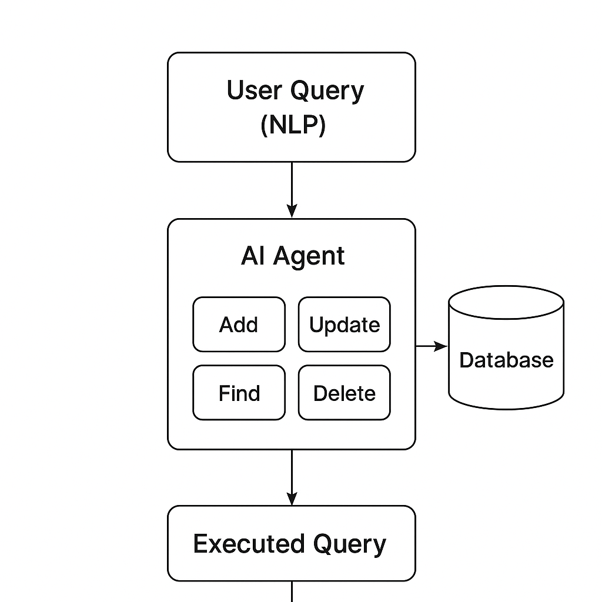

# MongoDB AI Agent

An AI-powered agent that enables natural language interaction with a live MongoDB Atlas database.
Users can perform real CRUD operations without writing queries, using plain English instructions.

This project explores agentic AI patterns where an LLM interprets intent and safely executes database tools.

---


## Features

* Natural language CRUD operations on MongoDB
* Live MongoDB Atlas integration (no mock data)
* LLM-based intent understanding with tool calling
* FastAPI backend for API access
* CLI and API interfaces
* Modular and extensible architecture

---

## Architecture Overview



User input (CLI or API)
→ LLM Agent (Gemini)
→ Tool Registry (CRUD operations)
→ MongoDB Atlas

---

## Tech Stack

* Python
* MongoDB Atlas
* Gemini LLM (Google Generative AI)
* LangChain / LangGraph
* FastAPI
* PyMongo

---

## Project Structure

```
mongoDB_aiAgent/
│
├── agent/          # Agent execution logic
├── api/            # FastAPI backend
├── core/           # Agent and LLM wiring
├── tools/          # MongoDB CRUD tools
│
├── main.py         # CLI entrypoint
├── test_mongo.py   # MongoDB connection test
│
├── .env            # Environment variables
├── requirements.txt
└── README.md
```

---

## Setup Instructions

### Clone the repository

```bash
git clone <your-github-repo-url>
cd mongoDB_aiAgent
```

---

### Create a virtual environment

```bash
python -m venv myenv
source myenv/bin/activate
# Windows: myenv\\Scripts\\activate
```

---

### Install dependencies

```bash
pip install -r requirements.txt
```

---

### Environment variables

Create a `.env` file in the root directory:

```env
MONGO_URI=your_mongodb_atlas_connection_string
GEMINI_API_KEY=your_gemini_api_key
```

---

### Test MongoDB connection

```bash
python test_mongo.py
```

Expected output:

```
Connected to MongoDB
```

---

## Running the Application

### CLI Mode

```bash
python main.py
```

Example queries:

```
Add a new movie titled "My Test Movie" released in 2025
Find the movie titled "My Test Movie"
```

---

### API Mode

```bash
uvicorn api.main_api:app --reload
```

Open in browser:

* [http://127.0.0.1:8000](http://127.0.0.1:8000)
* [http://127.0.0.1:8000/docs](http://127.0.0.1:8000/docs)

Example request body:

```json
{
  "query": "Retrieve the movie My Test Movie released in 2025"
}
```

---

## Safety and Design Notes

* The agent can only execute predefined tools
* No direct database access is exposed to the LLM
* CRUD operations are isolated and controlled
* Designed for extension with authentication and authorization layers

---

## Roadmap

* Improve response formatting
* Add authentication and access control
* Conversation memory
* Streaming responses
* Web UI
* Production deployment

---

## Contributions

Contributions and discussions are welcome.

If you are interested in agentic systems, database tooling, or backend architecture, feel free to open an issue or pull request.

---

## License

MIT License
